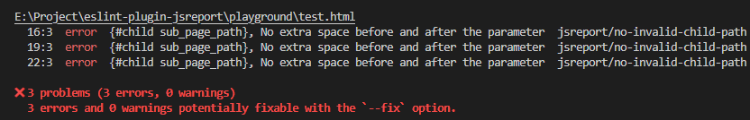

# eslint-plugin-jsreport

[](https://www.npmjs.com/package/eslint-plugin-jsreport)
[](./LICENSE)

> ESLint plugin for jsreport custom syntax validation

## ✨ Features

- **Rule: `no-invalid-child-path`**  
  Ensures `{#child sub_page_path}` syntax in HTML does not contain extra spaces before or after the parameter.

## 🚀 Quick Start

- Install

    ```bash
    npm install eslint-plugin-jsreport @html-eslint/parser --save-dev
    ```

- Usage

    Add the following to your `.eslint.config.ts` configuration:

    ```typescript
    import parser from '@html-eslint/parser';
    import jsreport from 'eslint-plugin-jsreport';

    export default [
        {
            files: ['*.html'],
            languageOptions: {
                parser,
                ecmaVersion: 2020,
                sourceType: 'module',
            },
            plugins: {
                jsreport,
            },
            rules: {
                'jsreport/no-invalid-child-path': 'error',
            },
        },
    ];
    ```

## 📝 Example

**Valid:**
```html
<div>{#child sub_page_path}</div>
```

**Invalid:**
```html
<div>{#child  sub_page_path}</div>
<div>{#child sub_page_path }</div>
<div>{#child  sub_page_path  }</div>
```

## 🧪 Playground

You can quickly try out what this plugin does in the [playground/test.html](./playground/test.html) file.  
Just edit or create an HTML file in the playground directory, write `{#child xxx}` syntax, and `npm run lint`
The plugin will automatically detect and report any invalid child path usage, `npm run lint:fix` syntax errors will be automatically fixed.



## 🤝 Contributing

Contributions are welcome!  
If you want to add new rules or improve existing ones, please submit a Pull Request.

**How to contribute a new rule:**
1. 🍴 Fork this repository.
2. 🌿 Create a new branch for your feature.
3. 📁 Add your rule under the `src/rules` directory.
4. 🧪 Add tests for your rule in the `test/rules` directory.
5. 📝 Update the documentation in this README if needed.
6. 🚀 Open a Pull Request with a clear description of your changes.

Tips: At present, the library can be used normally. Welcome everyone to experience. If you have any questions and suggestions, you can mention the feedback to me. If you are interested, you are welcome to join, let us improve this tool together. Help to click star ⭐, let more people know this tool, thank you for everyone🙏

## 📄 License

Translate is released under the MIT license. See the [`LICENSE`](./LICENSE) file.
